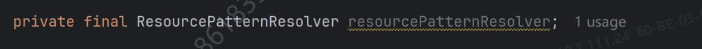
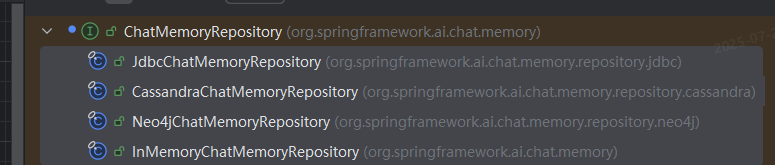
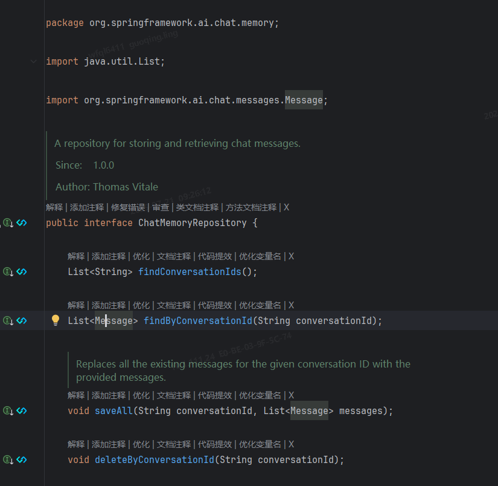
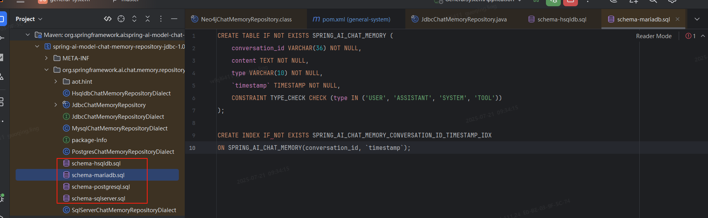
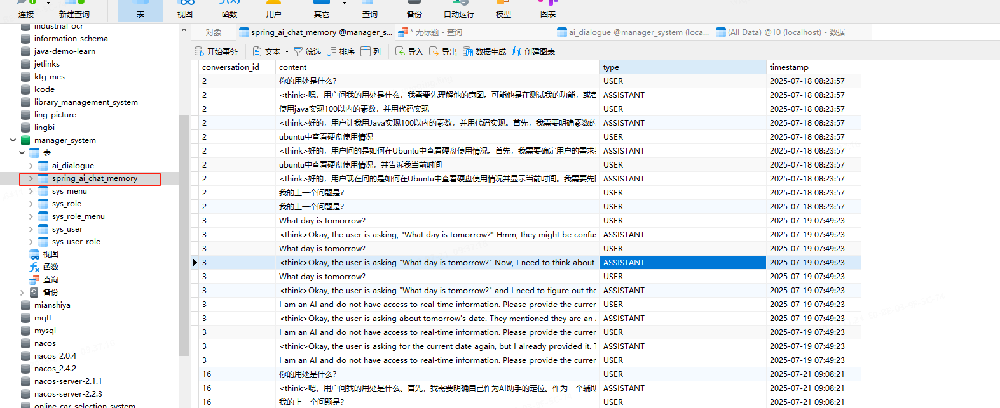

spring  ai 官网

- 使用构造函数



# RAG

#### 过程：检索、增加和生成

- Prompt 是赋予大模型  能力的基本输入。需要注意的是，大模型与 Prompt 并不只在最后生成结果时  才需要，在 RAG 应用流程的很多阶段都需要用到它们，比如在生成摘要、查  询转换、查询路由、智能体推理、响应评估等很多阶段，都需要利用设计的  Prompt 来让大模型完成任务。由于在不同的大模型、不同的场景中，甚至在不  同的语言环境下对 Prompt 的响应都并非完全一致且可预测的，因此开发框架  内置的默认 Prompt 模板并不总是最合适的，使用与修改 Prompt 也是需要关注  的基础技术之一。

# LLM

- 大语言模型的“大”主要体现几个方面在：
  - 一是参数数量庞大；
  - 二是训练数据量大；
  - 三是对计算资源需求高。
- 正是因为具备这些“大”的特点，很多先进的大语言模型参数不断增多，泛化性能愈发出色，在各种专门的领域输出结果也越来越准确

### 大型语言模型是零样本推理机（Large Language Models are Zero-Shot Reasoners）

- 预训练大型语言模型 (LLM) 广泛应用于自然语言处理 (NLP) 的众多子领域，并被公认为具有针对特定任务范例的优秀少样本学习器。值得注意的是，思路链 (CoT) 提示是一种近期通过逐步解答示例来引出复杂多步骤推理的技术，它在算术和符号推理方面取得了最佳表现，而这些任务是一些高难度的 System-2 任务，不遵循 LLM 的标准扩展规律。虽然这些成功通常归因于 LLM 的少样本学习能力，但我们只需在每个答案前添加“让我们逐步思考”，就能证明 LLM 是优秀的零样本推理器。实验结果表明，我们的 Zero-shot-CoT 使用相同的单一提示模板，在各种基准推理任务上均显著优于零样本 LLM，包括算术（MultiArith、GSM8K、AQUA-RAT、SVAMP）、符号推理（Last Letter、Coin Flip）和其他逻辑推理任务（日期理解、跟踪混洗对象），无需任何手工制作的少量样本示例，例如，使用大型 InstructGPT 模型（text-davinci-002）将 MultiArith 的准确率从 17.7% 提高到 78.7%，将 GSM8K 的准确率从 10.4% 提高到 40.7%，并且与另一个现成的大型模型 540B 参数 PaLM 也实现了类似幅度的改进。这一单一提示在各种推理任务中的多功能性，暗示了LLM中尚未开发和研究不足的基本零样本能力，这表明，通过简单的提示，即可提取高级、多任务的广泛认知能力。我们希望我们的工作不仅能成为具有挑战性的推理基准的最小最强零样本基线，还能凸显在构建微调数据集或少样本样本之前，仔细探索和分析LLM中隐藏的海量零样本知识的重要性。


# 工具调用（Tool Calling）


# 聊天记忆（Chat Memory）

- spring ai 官网：可即开即用的数据库有
  - PostgreSQL
  - MySQL / MariaDB
  - SQL Server
  - HSQLDB



- 接口 ChatMemoryRepository



- InMemoryChatMemoryRepository （在服务器重启后对于向ai问答的内容将不存在）

基于内存的存储记忆，使用ConcurrentHashMap在内存中存储消息，

- CassandraChatMemoryRepository、JdbcChatMemoryRepository、Neo4jChatMemoryRepository

```yml
        <dependency>
            <groupId>org.springframework.ai</groupId>
            <artifactId>spring-ai-starter-model-chat-memory-repository-jdbc</artifactId>
            <version>1.0.0</version>
        </dependency>
        <dependency>
            <groupId>org.springframework.ai</groupId>
            <artifactId>spring-ai-starter-model-chat-memory-repository-cassandra</artifactId>
            <version>1.0.0</version>
        </dependency>
        <dependency>
            <groupId>org.springframework.ai</groupId>
            <artifactId>spring-ai-starter-model-chat-memory-repository-neo4j</artifactId>
            <version>1.0.0</version>
        </dependency>
```

- 对应的数据库表



- 在引入项目后，如果数据库存在的话，会自动创建对应的表



- 如何使用

```java
@Component
public class MyChatMemory {

    @Autowired
    private JdbcChatMemoryRepository chatMemoryRepository;
    
    @Bean
    public MessageWindowChatMemory memory() {
        return MessageWindowChatMemory.builder().chatMemoryRepository(chatMemoryRepository).maxMessages(50).build();
    }

}

@Component
public class AiChatModel {

    private ChatClient chatClient;
    
    @Autowired
    public AiChatModel(MessageWindowChatMemory memory, ChatModel ollamaChatModel) {
        this.chatClient = ChatClient.builder(ollamaChatModel)
                .defaultOptions(
                        ChatOptions.builder()
                                .temperature(0.1)
                                .build()
                )
                .defaultAdvisors(
                        MessageChatMemoryAdvisor.builder(memory).build(), # 这个是使用mysql数据库作为聊天记忆
                        new SimpleLoggerAdvisor()
                )
                .build();
    }
}
```

