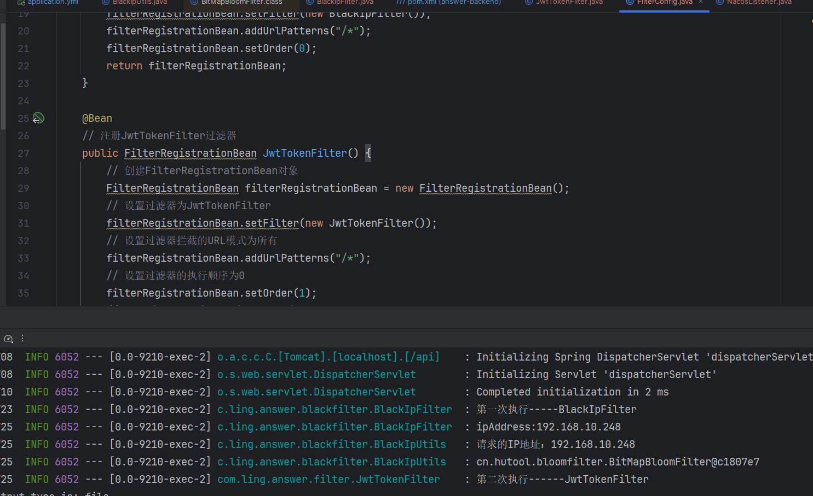

###  filter（拦截器）

- 官方文档地址：[Web (springdoc.cn)](https://springdoc.cn/spring-boot/web.html#web.servlet.embedded-container)

##### 过滤器的作用

- 过滤器（Filter）是 Java EE 中的一种组件，用于在请求到达 Servlet 之前或响应离开 Servlet 之后进行预处理和后处理。过滤器可以用于实现各种功能，比如日志记录、安全检查、字符编码设置等
- 过滤器的主要作用包括：
  1. **预处理**：在请求到达目标 Servlet 之前，过滤器可以执行一些预处理操作，比如验证用户身份、检查请求参数等。
  2. **后处理**：在响应离开目标 Servlet 之后，过滤器可以执行一些后处理操作，比如记录日志、修改响应内容等。
  3. **控制流程**：过滤器可以控制请求的处理流程，比如在验证失败时直接返回错误信息，而不继续执行目标 Servlet。
  4. **跨切面处理**：过滤器可以用于实现跨切面的功能，比如在多个 Servlet 中执行相同的逻辑，如日志记录、权限检查等。

##### 如何实现滤器

- 创建一个自定义过滤器类并实现Filter

```java
@WebFilter(urlPatterns = "/*", filterName = "jwtTokenFilter")
public class JwtTokenFilter implements Filter {
    @Override
    public void doFilter(ServletRequest servletRequest, ServletResponse servletResponse, FilterChain filterChain) throws IOException, ServletException {
        log.info("第二次执行------JwtTokenFilter");
        // 业务逻辑操作
        filterChain.doFilter(servletRequest, servletResponse);
        log.info("第二次执行完成------JwtTokenFilter");
    }
}
```

- 在启动类添加注解 @ServletComponentScan，实现自动注册

``` java
@ServletComponentScan
public class AnswerApplication {

    public static void main(String[] args) {
        SpringApplication.run(AnswerApplication.class, args);
    }
}
```

- 这只是单个自定义过滤器的实现

##### 多个过滤器的实现，并改变执行顺序

- 官方文东说了不能直接在实现的自定义拦过滤中直接使用`@Order` 注解其bean方法来配置 `Filter` 的顺序


- 实现自定义过滤器的执行顺序

  - 这里还要在写一个自定义的过滤器类，以便于观察（代码中实现的是过滤黑名单）
  - 实现两个以上也是一样

  ```java
  @WebFilter(urlPatterns = "/*", filterName = "blackIpFilter")
  public class BlackIpFilter implements Filter {
  
      @Override
      public void doFilter(ServletRequest servletRequest, ServletResponse servletResponse, FilterChain filterChain) throws IOException, ServletException {
          log.info("第一次执行-----BlackIpFilter");
          String ipAddress = NetUtils.getIpAddress((HttpServletRequest) servletRequest);
          log.info("ipAddress:{}", ipAddress);
          if (BlackIpUtils.isBlackIp(ipAddress)) {
              servletResponse.setContentType("text/json;charset=UTF-8");
              servletResponse.getWriter().write("{\"errorCode\":\"-1\",\"errorMsg\":\"黑名单IP，禁止访问\"}");
              return;
          }
          filterChain.doFilter(servletRequest, servletResponse);
          log.info("第一次执行完成-----BlackIpFilter");
      }
  }
  ```

```java
/**
 * 多个过滤器执行顺序
 */
@Configuration
public class FilterConfig {    
@Bean
    // 注册JwtTokenFilter过滤器
    public FilterRegistrationBean JwtTokenFilter() {
        // 创建FilterRegistrationBean对象
        FilterRegistrationBean filterRegistrationBean = new FilterRegistrationBean();
        // 设置过滤器为JwtTokenFilter
        filterRegistrationBean.setFilter(new JwtTokenFilter());
        // 设置过滤器拦截的URL模式为所有,可以根据自己需求设置需要过滤拦截的地址
        filterRegistrationBean.addUrlPatterns("/*");
        // 设置过滤器的执行顺序为0
        filterRegistrationBean.setOrder(0);
        // 返回FilterRegistrationBean对象
        return filterRegistrationBean;
    }
    @Bean
    public FilterRegistrationBean BlackIpFilter() {
        FilterRegistrationBean filterRegistrationBean = new FilterRegistrationBean();
        filterRegistrationBean.setFilter(new BlackIpFilter());
        filterRegistrationBean.addUrlPatterns("/*");
        filterRegistrationBean.setOrder(1);
        return filterRegistrationBean;
    }
}
```

- 执行结果


- 修改执顺序后的结果




# 最重要的一点就是查看官方文档