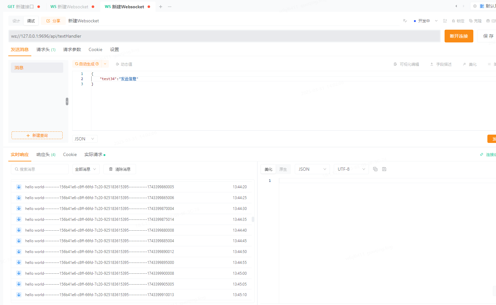

# websocket 学习

- 官方地址：https://docs.spring.io/spring-framework/reference/web/websocket.html

#### TextWebSocketHandler与BinaryWebSocketHandler区别

|            | TextWebSocketHandler                    | BinaryWebSocketHandler                      |
| ---------- | --------------------------------------- | ------------------------------------------- |
| 数据类型   | 处理文本消息（`String`或`TextMessage`） | 处理二进制消息（`byte[]`或`BinaryMessage`） |
| 典型场景   | JSON、XML、普通文本通信                 | 图片、音频、视频、文件传输等二进制数据      |
| 覆盖的方法 | handleTextMessage()                     | handleBinaryMessage()                       |

- WebSocketConfigurer 示例代码（简单案例，只是进行了建立连接、发送、接收）

```jade
import org.springframework.context.annotation.Configuration;
import org.springframework.web.socket.config.annotation.EnableWebSocket;
import org.springframework.web.socket.config.annotation.WebSocketConfigurer;
import org.springframework.web.socket.config.annotation.WebSocketHandlerRegistry;

import javax.annotation.Resource;

@Configuration
@EnableWebSocket
public class WebSocketConfiguration implements WebSocketConfigurer {

    @Resource
    private TextHandler textHandler;

    @Override
    public void registerWebSocketHandlers(WebSocketHandlerRegistry registry) {
        registry.addHandler(textHandler, "/textHandler");
    }
}

-----------------------------------------------------------------------------------------

import lombok.extern.slf4j.Slf4j;
import org.jetbrains.annotations.NotNull;
import org.springframework.stereotype.Component;
import org.springframework.web.socket.CloseStatus;
import org.springframework.web.socket.PongMessage;
import org.springframework.web.socket.TextMessage;
import org.springframework.web.socket.WebSocketSession;
import org.springframework.web.socket.handler.TextWebSocketHandler;

@Slf4j
@Component
public class TextHandler extends TextWebSocketHandler {

    /**
     * 处理关闭连接操作
     *
     * @param session
     * @param status
     * @throws Exception
     */
    @Override
    public void afterConnectionClosed(WebSocketSession session, CloseStatus status) throws Exception {
        log.info("处理关闭连接：{}", String.valueOf(status));
    }

    @Override
    public void handleTransportError(WebSocketSession session, Throwable exception) throws Exception {
    }

    @Override
    protected void handlePongMessage(WebSocketSession session, PongMessage message) throws Exception {
        log.info("handlePongMessage-----------{}", message);
    }


    /**
     * 处理操作立连接
     *
     * @param session
     * @throws Exception
     */
    @Override
    public void afterConnectionEstablished(WebSocketSession session) throws Exception {
        log.info("建立连接");
        log.info("afterConnectionEstablished-----------{}", session);
        session.sendMessage(new TextMessage("建立连接后，发送信息"));
    }

    @Override
    protected void handleTextMessage(@NotNull WebSocketSession session, @NotNull TextMessage message) throws Exception {
        log.info("handleTextMessage-----------{}", message);
    }
}
```

- 通过**Apipost**进行测试

